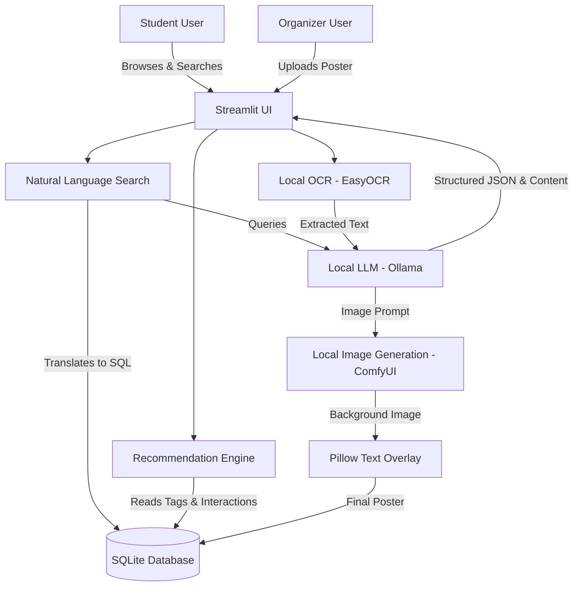

# Architecture Diagram

```mermaid
graph TD
    Student[Student User] -->|Browses & Searches| UI[Streamlit UI]
    Organizer[Organizer User] -->|Uploads Poster| UI
    
    UI --> NLP[Natural Language Search]
    UI --> Recs[Recommendation Engine]
    
    NLP -->|Queries| LLM[Local LLM - Ollama]
    NLP -->|Translates to SQL| DB[(SQLite Database)]
    Recs -->|Reads Tags & Interactions| DB
    
    UI --> OCR[Local OCR - EasyOCR]
    OCR -->|Extracted Text| LLM
    LLM -->|Structured JSON & Content| UI
    LLM -->|Image Prompt| ImageGen[Local Image Generation - ComfyUI]
    ImageGen -->|Background Image| Utils[Pillow Text Overlay]
    Utils -->|Final Poster| DB
```
