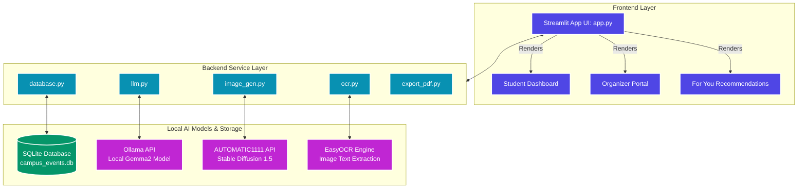

# Campus Event AI - System Architecture

```mermaid
graph TD
    subgraph Frontend [Frontend Layer]
        UI[Streamlit App UI: app.py]
        UI --> |Renders| Dashboard[Student Dashboard]
        UI --> |Renders| Portal[Organizer Portal]
        UI --> |Renders| ForYou[For You Recommendations]
    end

    subgraph Backend [Backend Service Layer]
        DB_Manager[database.py]
        LLM_Manager[llm.py]
        IMG_Manager[image_gen.py]
        OCR_Manager[ocr.py]
        PDF_Manager[export_pdf.py]
    end

    subgraph DataAndModels [Local AI Models & Storage]
        DB[(SQLite Database\ncampus_events.db)]
        Ollama[Ollama API\nLocal Gemma2 Model]
        A1111[AUTOMATIC1111 API\nStable Diffusion 1.5]
        EasyOCR[EasyOCR Engine\nImage Text Extraction]
    end

    %% Connections
    UI <--> Backend
    
    DB_Manager <--> DB
    LLM_Manager <--> Ollama
    IMG_Manager <--> A1111
    OCR_Manager <--> EasyOCR
    
    classDef ui fill:#4f46e5,stroke:#fff,stroke-width:2px,color:#fff;
    classDef backend fill:#0891b2,stroke:#fff,stroke-width:2px,color:#fff;
    classDef db fill:#059669,stroke:#fff,stroke-width:2px,color:#fff;
    classDef ai fill:#c026d3,stroke:#fff,stroke-width:2px,color:#fff;
    
    class UI,Dashboard,Portal,ForYou ui;
    class DB_Manager,LLM_Manager,IMG_Manager,OCR_Manager,PDF_Manager backend;
    class DB db;
    class Ollama,A1111,EasyOCR ai;
```
