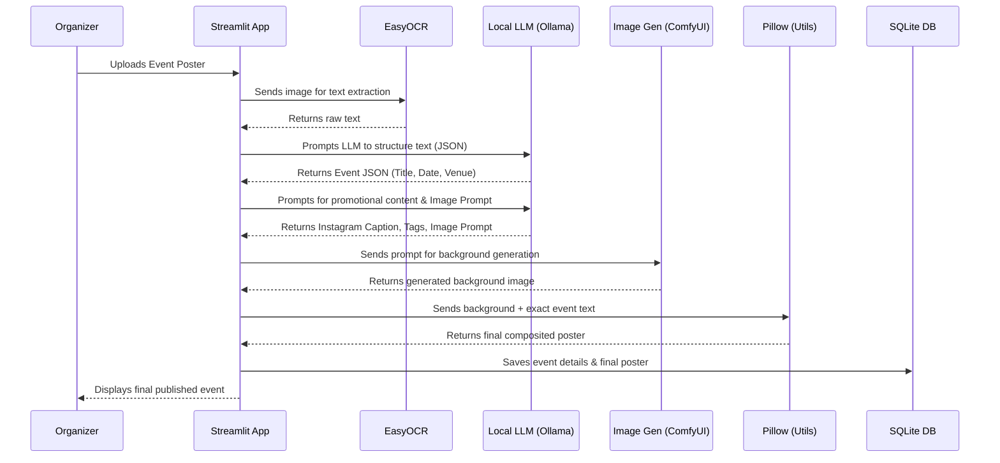

# Workflow Diagram

```mermaid
sequenceDiagram
    participant Org as Organizer
    participant UI as Streamlit App
    participant OCR as EasyOCR
    participant LLM as Local LLM (Ollama)
    participant IG as Image Gen (ComfyUI)
    participant PIL as Pillow (Utils)
    participant DB as SQLite DB

    Org->>UI: Uploads Event Poster
    UI->>OCR: Sends image for text extraction
    OCR-->>UI: Returns raw text
    UI->>LLM: Prompts LLM to structure text (JSON)
    LLM-->>UI: Returns Event JSON (Title, Date, Venue)
    UI->>LLM: Prompts for promotional content & Image Prompt
    LLM-->>UI: Returns Instagram Caption, Tags, Image Prompt
    UI->>IG: Sends prompt for background generation
    IG-->>UI: Returns generated background image
    UI->>PIL: Sends background + exact event text
    PIL-->>UI: Returns final composited poster
    UI->>DB: Saves event details & final poster
    UI-->>Org: Displays final published event
```
