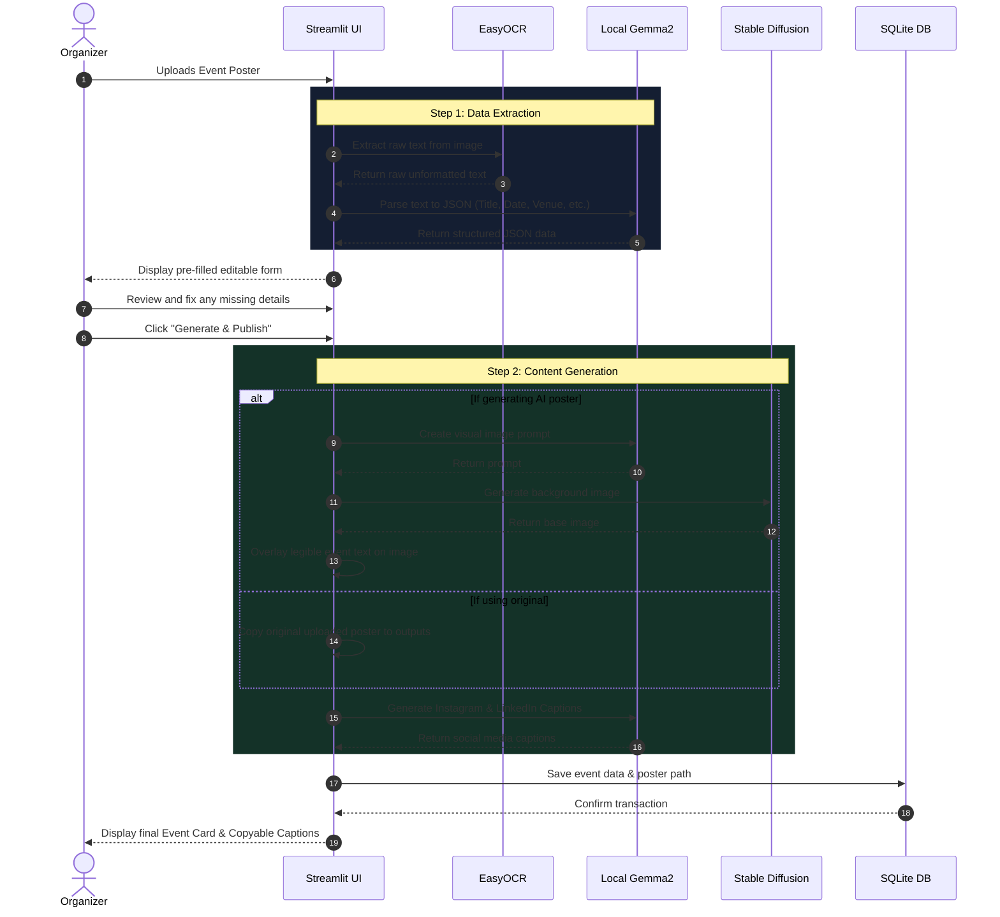

# Event Creation Workflow

```mermaid
sequenceDiagram
    autonumber
    actor Org as Organizer
    participant UI as Streamlit UI
    participant OCR as EasyOCR
    participant LLM as Local Gemma2
    participant A1111 as Stable Diffusion
    participant DB as SQLite DB

    Org->>UI: Uploads Event Poster
    
    rect rgb(20, 30, 50)
        Note over UI,LLM: Step 1: Data Extraction
        UI->>OCR: Extract raw text from image
        OCR-->>UI: Return raw unformatted text
        UI->>LLM: Parse text to JSON (Title, Date, Venue, etc.)
        LLM-->>UI: Return structured JSON data
    end

    UI-->>Org: Display pre-filled editable form
    Org->>UI: Review and fix any missing details
    Org->>UI: Click "Generate & Publish"
    
    rect rgb(20, 50, 40)
        Note over UI,A1111: Step 2: Content Generation
        
        alt If generating AI poster
            UI->>LLM: Create visual image prompt
            LLM-->>UI: Return prompt
            UI->>A1111: Generate background image
            A1111-->>UI: Return base image
            UI->>UI: Overlay legible event text on image
        else If using original
            UI->>UI: Copy original uploaded poster to outputs
        end
        
        UI->>LLM: Generate Instagram & LinkedIn Captions
        LLM-->>UI: Return social media captions
    end

    UI->>DB: Save event data & poster path
    DB-->>UI: Confirm transaction
    UI-->>Org: Display final Event Card & Copyable Captions
```
